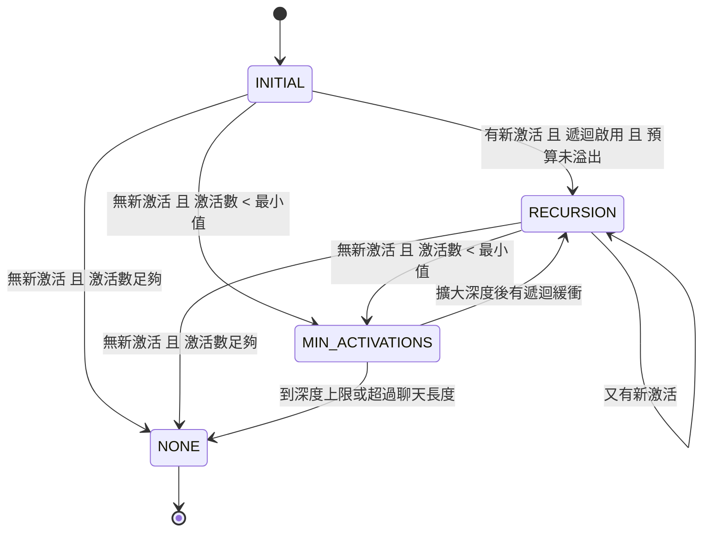

## 🎯 什麼情境該想到我
當你「手上有幾百條世界觀設定，但每次對話只想把真的被聊到的那幾條塞進 prompt」的時候。

## ⚙️ 怎麼用

### 核心想法：條件式知識注入
一個完整的角色扮演世界有大量設定——地名、魔法系統、組織、歷史事件。全部塞進 prompt，token 立刻爆掉。World Info（又稱 Lorebook、世界書）的做法是：**每條設定綁一組關鍵詞，只有當對話「提到」這些詞時，該條內容才被動態注入 prompt**。於是你可以擁有幾百條設定，但每輪只付「真正需要的那幾條」的 token。

可以把它理解成「用關鍵詞當檢索條件的極簡 RAG」：沒有向量、沒有 embedding，靠字串／正則匹配決定召回什麼，換來的是**可預測、可除錯**——作者寫下關鍵詞時就知道它何時會出現。

### 一個條目長什麼樣（關鍵欄位）

| 分類 | 欄位 | 作用 |
|------|------|------|
| 核心 | `key[]` | 主關鍵詞，任一命中即觸發 |
| | `keysecondary[]` + `selectiveLogic` | 次要關鍵詞與邏輯（見下） |
| | `content` | 真正要注入的文字 |
| | `position` / `order` | 注入位置（0–7）與同位置排序（越小越前） |
| | `depth` / `role` | `position=atDepth` 時的深度與訊息角色（system/user/assistant） |
| 匹配 | `caseSensitive` / `matchWholeWords` | 大小寫、全詞匹配 |
| | `scanDepth` | 覆蓋全域掃描深度（往回看幾則訊息） |
| | `matchCharacterDescription` / `matchPersonaDescription` / `matchScenario` | 把角色描述、使用者人設、場景也納入掃描來源 |
| 遞迴 | `excludeRecursion` / `preventRecursion` / `delayUntilRecursion` | 控制它與遞迴掃描的關係 |
| 其他 | `constant` | 常駐，不需關鍵詞 |
| | `probability` | 激活機率 0–100 |
| | `group` / `groupWeight` / `groupOverride` | 包含組（互斥）控制 |
| | `sticky` / `cooldown` / `delay` | 時間效果 |
| | `triggers[]` | 只在特定生成類型（如 continue、impersonate）才激活 |
| | `ignoreBudget` | 不受 WI token 預算限制 |
| | `characterFilter` | 依角色／標籤包含或排除 |
| | `decorators[]` | `@@activate`、`@@dont_activate` |

### 掃描範圍：到底在「哪些文字」裡找關鍵詞
入口是 `checkWorldInfo(chat, maxContext)`。它先組出一個「掃描緩衝區」，來源包括：
1. 聊天歷史——只取最近 `scanDepth` 則；
2. 角色描述／個性／場景、使用者人設——**可選**，由條目上的 `match*` 旗標決定；
3. 標記 `scan=true` 的 Extension Prompts（例如允許 WI 掃描的 Author's Note）；
4. 遞迴緩衝——已被激活條目的 **content**。

★ 第 4 點是整個系統的關鍵：「設定能帶出設定」。

### 六層過濾管線（每個條目都要全過）

| 層 | 名稱 | 判斷 | 結果 |
|----|------|------|------|
| 1 | 基礎過濾 | disabled？已激活過？這輪機率已擲失敗？生成類型不符 `triggers`？角色／標籤過濾不過？ | 任一成立 → 跳過 |
| 2 | 時間效果 | 在 delay 期間？cooldown 中且非 sticky？`delayUntilRecursion` 但現在不是遞迴階段？`excludeRecursion` 但現在是遞迴階段？ | 任一成立 → 跳過 |
| 3 | 裝飾器 | `@@activate` 或外部強制激活 → **直接激活並跳過後續層**；`@@dont_activate` → 直接跳過 | 短路 |
| 4 | 常駐條件 | `constant=true` 或 sticky 生效中 | 直接激活 |
| 5 | 主鍵匹配 | 在掃描緩衝搜尋每個主鍵（一般文字／正則／全詞） | 任一命中 → 通過 |
| 6 | 次要鍵邏輯 | 依 `selectiveLogic` 判斷 | 見下表 |

次要鍵的四種邏輯（前提都是主鍵已命中）：

| 邏輯 | 條件 | 典型用法 |
|------|------|---------|
| `AND_ANY` | 任一次鍵也命中 | 「龍」＋（「火」或「巢穴」）才講火龍巢穴 |
| `AND_ALL` | 全部次鍵都命中 | 需要多個情境同時成立 |
| `NOT_ANY` | 沒有任何次鍵命中 | 「國王」但不是在講「棋局」 |
| `NOT_ALL` | 次鍵並非全部命中 | 排除某個特定組合 |

通過六層之後還有兩道關卡：**包含組競爭**（同組只留一個），以及**機率與預算**（`random ≤ probability` 且累計 token 未超過 WI 預算），才算真正激活。

### 掃描狀態機：INITIAL → RECURSION → MIN_ACTIVATIONS → NONE

| 狀態 | 目的 | 行為 |
|------|------|------|
| INITIAL | 首輪掃描 | 在目前掃描深度內匹配所有條目 |
| RECURSION | 被激活的條目可能再帶出別的條目 | 把新激活條目的 content 加進掃描範圍，重掃 |
| MIN_ACTIVATIONS | 保證最少激活數 | 逐步擴大掃描深度，直到達標或到上限 |

**遞迴的具體例子**：
1. 使用者說「我想去睡龍酒館」→ 條目 A（睡龍酒館）激活。
2. A 的內容是「睡龍酒館養了一條寵物龍……」。
3. 進入 RECURSION：A 的內容加入掃描範圍。
4. 條目 B 的關鍵詞是「龍」→ B 被激活。
5. 重複直到沒有新激活。

★ 為什麼要有 MIN_ACTIVATIONS？對話剛開始或話題很窄時，最近幾則訊息可能一個關鍵詞都沒碰到，模型等於「失憶」。這個狀態允許系統往更早的歷史挖，確保至少有幾條背景設定在場。

### 包含組：同類互斥
同一 `group` 的條目若同時被激活，只能留一個。勝出順序：
1. 有 sticky 條目 → sticky 直接勝出（避免正在持續的狀態被中途換掉）；
2. 否則若啟用 `groupScoring` → 計算主鍵＋次鍵命中數，最高分勝；
3. 否則若有 `groupOverride` → 依 `order` 排序，最小者勝；
4. 否則 → 依 `groupWeight` 做加權隨機。

典型用途是天氣系統：晴天、雨天、雪天放同一組，每次只會出現一種。

### 時間效果：delay / sticky / cooldown
以「delay=3、sticky=3、cooldown=2」為例（依原文件的序列圖）：
- 訊息 1–3：delay 期間，不檢測；
- 訊息 4：開始正常檢測；訊息 5：關鍵詞命中，激活；
- 訊息 6–8：sticky，即使沒再提到也持續激活（1/3、2/3、3/3）；
- 訊息 9–10：cooldown，強制休息不檢測；
- 訊息 11：恢復正常。

★ 這三個欄位解決的是「關鍵詞觸發太即時」的問題：sticky 讓剛提到的事件在後續幾輪還記得；cooldown 防止同一條設定每輪都被塞、洗版；delay 讓某些劇情設定在對話早期不要冒出來。

### 注入位置：激活後放到哪
| position | 值 | 位置 | 適用 |
|----------|---|------|------|
| before | 0 | 角色描述前 | 世界觀背景 |
| after | 1 | 角色描述後 | 角色相關補充 |
| ANTop | 2 | Author's Note 頂部 | 需要高優先級的指令 |
| ANBottom | 3 | Author's Note 底部 | AN 的補充 |
| atDepth | 4 | 聊天歷史中的指定深度（配 `depth`、`role`） | 動態情境提示 |
| EMTop | 5 | 對話範例頂部 | 範例前置說明 |
| EMBottom | 6 | 對話範例底部 | 範例後置說明 |
| outlet | 7 | 不自動放，由 `{{outlet::key}}` 在任意位置讀取 | 需要精準放置時 |

整體順序：WI Before → 角色描述 → WI After → EMTop → 對話範例 → EMBottom → 聊天歷史（其中穿插 atDepth 與 AN 區塊）。

★ 位置的選擇本質是「注意力 vs 穩定」的取捨：放在 prompt 前段（0/1）穩定但離生成點遠；放在 AN 或 atDepth（2/3/4）離生成點近、影響力大。背景知識放前面，會改變行為的指引放後面。

## ⚠️ 注意 / 什麼時候不適用
- **關鍵詞是字面匹配，不懂語意**。使用者說「那條會噴火的大蜥蜴」不會命中「龍」。需要語意召回時要搭配向量檢索（見 [[工具-RAG檢索增強生成]]），或把同義詞都列進 `key[]`。
- **遞迴可能連鎖爆量**。一條內容寫得很廣的條目可能帶出一串條目，把 WI 預算吃光；對「總綱」型條目開 `preventRecursion`，只想被帶出的細節條目用 `delayUntilRecursion`。
- **WI 有獨立預算**（預設 max_context 的 25%），超過就不再激活；少數關鍵條目才該開 `ignoreBudget`，否則預算形同虛設（見 [[Token預算管理]]）。
- **`probability` 與加權隨機讓輸出不可重現**，除錯時先關掉。
- 原文件稱「六層過濾」，但包含組與機率／預算是第六層之後的兩道額外關卡，實作時別漏掉。
- 所有條目預設在 INITIAL 被掃一遍，條目數量極大時每輪掃描成本不可忽視。

## 🧪 我實際套用的紀錄
- （尚無）

## 🔗 相關
- [[Token預算管理]]——WI 獨立預算的計算與超額行為
- [[Authors Note與深度注入]]——WI 的 ANTop/ANBottom/atDepth 位置如何跟 AN 合成
- [[宏系統]]——`{{outlet::key}}` 讀取 position=outlet 的條目；WI 激活後內容也會跑宏替換
- [[生成類型]]——`triggers[]` 依生成類型過濾
- [[長期記憶三層架構]]——向量記憶作語義觸發，補關鍵詞比對的漏觸發
- [[場景與故事走向控制]]——WI 作為條件式的劇情引導手段
- [[工具-RAG檢索增強生成]]——語意召回的對照方案
