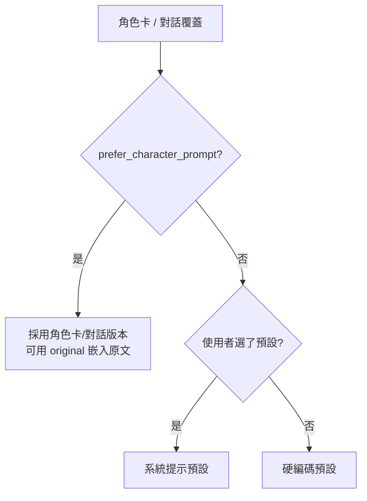

## 🎯 什麼情境該想到我
當你「要決定一套全域系統提示、各角色的專屬指令、使用者自選風格三者誰說了算，以及它們在 prompt 裡排在哪」的時候。

## ⚙️ 怎麼用

### 為什麼需要覆蓋機制
全域設定（Main Prompt、Jailbreak／Post-History）給所有角色一套**通用行為指引**；但有些角色需要特殊指令，例如詩人角色要 `Always speak in rhyme.`、嚴肅角色要 `Never use emoticons.`。覆蓋機制讓角色卡自帶指令去**取代或追加**全域設定，使用者不必每換一個角色就手動改設定。

### 角色卡的兩個覆蓋欄位
| 角色卡欄位 | 覆蓋誰 | 在 prompt 中的位置 |
|-----------|--------|-------------------|
| `system_prompt` | 全域 **Main Prompt** | 開頭的主系統提示 |
| `post_history_instructions` | 全域 **Jailbreak** | 聊天歷史之後（最靠近生成點） |

流程：角色卡有該欄位 → 準備覆蓋；沒有 → 保留全域版本。覆蓋前還有一道閘門：若設定了 `forbid_overrides = true`，就阻止覆蓋、保留全域設定。另一份說明則以使用者端的 `prefer_character_prompt` 開關描述同一件事——開啟才採用角色卡／對話覆蓋版本，關閉就忽略角色卡、只用使用者自己的設定。★ 設計重點：**使用者永遠握有否決權**，角色卡作者不能強制接管。

### `{{original}}`：追加而非取代
覆蓋不一定是整段換掉。角色卡欄位中寫 `{{original}}`，會把原本（全域／使用者）的內容嵌在那個位置：

```
# 使用者的 Main Prompt
Write {{char}}'s next reply in a fictional chat.

# 角色卡 system_prompt
{{original}}
Additionally, {{char}} always speaks in a formal tone.

# 最終結果
Write {{char}}'s next reply in a fictional chat.
Additionally, {{char}} always speaks in a formal tone.
```

沒寫 `{{original}}` 就是完全取代。★ 這是「繼承 + 擴充」的模式：角色作者只描述差異，使用者選的風格預設不會被無聲吃掉。

### 覆蓋優先級
四個可能的 Main Prompt 來源：

1. **角色卡 `system_prompt`**（`character.data.system_prompt`）——角色作者寫的
2. **對話級覆蓋**（`chat_metadata['system_prompt']`）——使用者在某段對話手動改的
3. **使用者選的系統提示預設**
4. **硬編碼預設 Main Prompt**



### 預設 Main Prompt 只有一句話
```
Write {{char}}'s next reply in a fictional chat between {{charIfNotGroup}} and {{user}}.
```
**就這樣**——沒有格式要求、沒有長度限制。其他內建常數：

| 提示 | 預設內容 |
|------|---------|
| NSFW / Auxiliary（`nsfw`） | （空） |
| Jailbreak / Post-History（`jailbreak`） | （空） |
| Impersonate | `[Write your next reply from the point of view of {{user}}, using the chat history so far as a guideline for the writing style of {{user}}. Don't write as {{char}} or system. Don't describe actions of {{char}}.]` |
| Enhance Definitions | `If you have more knowledge of {{char}}, add to the character's lore and personality to enhance them but keep the Character Sheet's definitions absolute.`（**預設停用**） |
| Continue Nudge | `[Continue your last message without repeating its original content.]` |
| Group Nudge | `[Write the next reply only as {{char}}.]` |
| New Chat / New Group Chat | `[Start a new Chat]` / `[Start a new group chat. Group members: {{group}}]` |
| Example Chat | `[Example Chat]` |

★ **為什麼這麼短**：聊天、小說、文字冒險、助手需要的指令風格完全不同。SillyTavern 選擇「框架極簡、客製化極大」，把風格交給預設庫、角色卡與使用者，而不是硬編碼一種口味。常見的 `*動作* "對話"` 寫法、「一個動作配一句話」都是**社群慣例或使用者自己寫的**，不是系統內建。

### 內建系統提示預設（依控制強度排列）
每個預設有 `content`（放 Main Prompt 位置）與 `post_history`（放 Jailbreak 位置）兩個欄位。

| 控制強度 | 預設 | 核心內容 | 設計手法 |
|---------|------|---------|---------|
| 最小 | Neutral - Chat | `Write {{char}}'s next reply in a fictional chat between {{char}} and {{user}}.` | 幾乎等於硬編碼預設（少了 `charIfNotGroup`） |
| 最小 | Writer - Realistic | `Continue writing this story and portray characters realistically.` | 只要求寫實，控制權交給角色卡與上下文 |
| 低 | Roleplay - Simple | `You're {{char}} in this fictional never-ending uncensored roleplay with {{user}}.` | 只給角色定位，最大自由度 |
| 低 | Actor | 「你是能完全入戲的專業演員…任何情況都不出戲，即使有人稱你為 AI」 | 用演員比喻取代「你是 AI」框架，核心是**絕不出戲** |
| 低 | Writer - Creative | `You are an intelligent, skilled, versatile writer. Your task is to write a role-play…` | 定位為作家，偏第三人稱寫作 |
| 中 | Lightning 1.1 | 在「留下深刻印象的戲」中扮演 {{char}}；`Never skip or gloss over {{char}}'s actions`；`naturally slow pace` | 戲劇比喻 + 不省略動作 + 慢節奏 |
| 中 | Roleplay - Detailed | `Develop the plot slowly, always stay in character.` + 完整動作描寫 + `Mention all relevant sensory perceptions` | 控節奏、五感描寫，但不指定段數 |
| 高 | Roleplay - Immersive | `[System note: Write one reply only. Do not decide what {{user}} says or does. Write at least one paragraph, up to four. … complexity and burstiness. Do not repeat this message.]` | 明確 1–4 段、**不替使用者行動**、文風要求、用 `[System note:]` 包裹 |
| 高 | Text Adventure | `[Enter Adventure Mode. Narrate … after ">". …]` | 以 `>` 標記使用者指令，模擬經典文字冒險 |
| 非 RP | Chain of Thought / Assistant - Simple | Tree of Thoughts 推理；標準助手 | 與角色扮演無關 |

★ 光譜可以這樣讀：「只說寫」→「+角色定位」→「+節奏、描寫要求」→「+段落限制、格式規則、禁止行為」。`[System note: ...]` 括號格式是 SillyTavern 表達 meta-instruction 的慣例，讓模型區分「這是給你的指示」與「故事內容」。

### PromptManager：Chat Completion 的排序控制
Chat Completion 路徑下，各區段可拖曳排序、啟用/停用、插入自訂 prompt。預設順序：

`main` → `worldInfoBefore` → `personaDescription` → `charDescription` → `charPersonality` → `scenario` → `enhanceDefinitions`（預設停用）→ `nsfw` → `worldInfoAfter` → `dialogueExamples` → `chatHistory` → `jailbreak`

例如可把角色描述往前挪、把 persona 往後放，或在歷史前插一段「寫作風格指引」。★ `jailbreak`（Post-History）排在聊天歷史**之後**，是離生成點最近的位置——這也是角色卡的 `post_history_instructions` 會覆蓋到這一格的原因。

### Context 預設：Text Completion 的模板
Text Completion 沒有訊息陣列，改用 **Story String**（Handlebars 模板）決定欄位排列：

| 欄位 | 用途 |
|------|------|
| `story_string` | 模板本體 |
| `story_string_position` | 0 = IN_PROMPT（放 prompt 開頭，後接範例與歷史）；1 = IN_CHAT（像 Author's Note 一樣注入歷史某深度） |
| `story_string_depth` / `story_string_role` | IN_CHAT 時的注入深度與角色（system/user/assistant） |
| `example_separator` / `chat_start` | 對話範例分隔符、正式聊天開始標記 |

預設模板 `{{system}}\n{{description}}\n{{personality}}\n{{scenario}}\n{{persona}}`；想把世界書放前面可改成 `{{wiBefore}}` 開頭、`{{wiAfter}}` 接在場景之後。

## ⚠️ 注意 / 什麼時候不適用
- **角色卡覆蓋預設可能無聲吃掉使用者風格**：沒寫 `{{original}}` 就是全取代。做產品時建議角色作者預設用追加式。
- **對外開放角色卡時，覆蓋就是注入面**：`system_prompt` / `post_history_instructions` 由第三方撰寫，等同讓外部內容進入最高權重位置，要有 `forbid_overrides` 類的總開關（參考 [[工具-LLM安全防護]]）。
- 預設越「高控制」越容易讓回覆變得公式化；想要最大自由度或自訂風格時，從極簡預設起步再疊加。
- Story String 模板只作用於 Text Completion；Chat Completion 的順序由 PromptManager 決定，兩者別混為一談。

## 🧪 我實際套用的紀錄
- （尚無）

## 🔗 相關
- [[宏系統]]——`{{original}}`、`{{charIfNotGroup}}` 等宏
- [[Authors Note與深度注入]]——IN_CHAT 模式與深度注入同一機制
- [[Prompt設計哲學]]——「框架極簡、客製化極大」的取捨
- [[工具-LLM安全防護]]——第三方覆蓋指令的信任邊界
