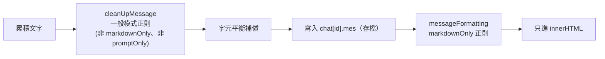

## 🎯 什麼情境該想到我
當你「想在不動角色卡、不動世界書的前提下，對進出模型的文字做格式清理、偷塞指令或只改畫面顯示」的時候。

## ⚙️ 怎麼用

### 它是什麼：可程式化的文字變換層
正則引擎的本質很單純：在 prompt 管線的**特定時間點**，對文字執行 JavaScript 的 `string.replace(regex, replacement)`。它解決角色卡與 [[World Info世界書]] 都處理不了的事：

- **格式轉換**：`*動作*` → `（動作）`
- **內容過濾**：移除 AI 回應裡的某些模式（例如 OOC 說明）
- **動態改寫**：只改送給模型的措辭
- **UI 美化**：顯示前改格式，但不改存檔

★ SillyTavern **不附帶任何預設正則腳本**，所有規則都由使用者自己建立、匯入，或跟著角色卡帶進來。

### 三層腳本來源與安全授權
| 來源 | 定義在哪 | 生效範圍 | 需授權？ |
|------|---------|---------|---------|
| GLOBAL | 全域設定 | 所有角色 | 否 |
| SCOPED | 角色卡內嵌 | 只對該角色 | **是** |
| PRESET | API 預設 | 使用該預設時 | **是** |

執行順序是 GLOBAL → SCOPED → PRESET。**為什麼 SCOPED/PRESET 要授權**：角色卡多半從網路下載，可能夾帶惡意正則（例如把所有對話偷偷換成特定內容）。要求明確授權，讓使用者至少知道腳本存在——這是把「外來資料可執行邏輯」當成信任邊界處理。

### Placement：在管線哪個點觸發
| Placement | 值 | 觸發場景 | 典型用途 |
|-----------|---|---------|---------|
| USER_INPUT | 1 | 使用者訊息進 prompt、送出時 | 格式化使用者輸入 |
| AI_OUTPUT | 2 | AI 回應被處理時（含角色首則問候語） | 清理 AI 輸出 |
| SLASH_COMMAND | 3 | `/send`、`/narrator` 等命令 | 命令結果格式化 |
| WORLD_INFO | 5 | WI 條目被注入時 | 調整 WI 內容 |
| REASONING | 6 | 推理/思考鏈內容 | 過濾或格式化推理 |

一個腳本的 `placement[]` 可多選。組聊天歷史時，每一則訊息依其身分走 USER_INPUT 或 AI_OUTPUT 的腳本。

### 作用域：誰看得到替換結果（最關鍵的設計）
| 設定 | 何時執行 | 存檔 | UI | AI 看到 |
|------|---------|------|----|--------|
| `markdownOnly=true` | 只在 Markdown 渲染（`isMarkdown=true`） | 不變 | **改** | 不變 |
| `promptOnly=true` | 只在構建 prompt（`isPrompt=true`） | 不變 | 不變 | **改** |
| 兩者皆 false | 非 Markdown、非 Prompt 的一般處理 | **永久改** | 改 | 改 |

★ 這讓你能做到「AI 看到的」和「使用者看到的」不一樣——這種**短暫性（ephemerality）**是正則引擎真正的價值：
- UI 美化（markdownOnly）：`---` 畫成分隔線，prompt 裡仍是 `---`
- 隱藏指令（promptOnly）：每則訊息後面接 `[保持角色]`，聊天介面完全看不到
- 一般模式：真的改寫訊息內容並存檔，適合清掉模型的壞習慣

### 深度過濾
腳本可用 `minDepth` / `maxDepth` 限定只對聊天歷史某段生效（depth 0 = 最新一則，往舊遞增；`-1` = 不限）。例如 `minDepth:0, maxDepth:3` 只處理最近 4 則。用途：只對近期訊息做轉換，舊歷史保持原樣。

### 單一腳本的執行流程
1. 收集所有啟用腳本（GLOBAL + SCOPED + PRESET）
2. 逐一檢查：placement 是否匹配 → markdownOnly/promptOnly 是否符合當下模式 → 深度是否在範圍 → 編輯情境（`runOnEdit`）
3. 通過後：若 `substituteRegex ≠ 0`，先對 `findRegex` 做宏替換
4. 編譯正則（有 **LRU Cache**，同一腳本不會重複編譯）
5. 執行 `replace()`，處理 `$1`、`$2`、`$<name>`、`{{match}}`
6. 從捕獲組移除 `trimStrings[]` 列出的字串後輸出

### 腳本欄位速查
| 欄位 | 用途 |
|------|------|
| `findRegex` | 搜尋正則（可含 flags） |
| `replaceString` | 替換字串，支援 `$1`、`$<name>`、`{{match}}` |
| `trimStrings[]` | 從捕獲組移除的字串 |
| `placement[]` | 應用位置（可多選） |
| `markdownOnly` / `promptOnly` | 作用域 |
| `runOnEdit` | 編輯訊息時是否執行 |
| `substituteRegex` | 0=不替換宏、1=原始替換、2=轉義替換 |
| `minDepth` / `maxDepth` | 深度範圍（-1 無限制） |

### substituteRegex：正則裡用宏的陷阱
`findRegex` 可以含 [[宏系統]] 的宏，例如 `^{{char}}:\s*`。角色名是 `A.I. Helper` 時：
- 模式 1（原始）：實際正則 `A.I. Helper`，`.` 會匹配任意字元，**不精確**
- 模式 2（轉義）：實際正則 `A\.I\. Helper`，**精確匹配**

★ 角色名來自使用者輸入，任何可能含 `.`、`(` 等特殊字元的情況都該選 2。

### 實戰模式速查
| 目的 | findRegex | replaceString | placement / 作用域 |
|------|-----------|---------------|------|
| 移除回覆開頭的角色名 | `^{{char}}:\s*` | （空） | AI_OUTPUT |
| 移除 OOC 說明 | `\(OOC:.*?\)` | （空） | AI_OUTPUT |
| 收斂 `***動作***` | `\*{2,}` | `*` | AI_OUTPUT |
| 強制句尾標點 | `([^.!?。！？\s])\s*$` | `$1.` | AI_OUTPUT |
| 星號動作轉圓括號 | `\*([^*]+)\*` | `（$1）` | AI_OUTPUT |
| 斜體只在畫面渲染 | `\*([^*]+)\*` | `<em>$1</em>` | AI_OUTPUT + markdownOnly |
| 每則訊息追加隱藏指令 | `(^[\s\S]+$)` | `$1\n[Stay in character]` | USER_INPUT + promptOnly |
| 送給 AI 前替換敏感詞 | `暴力` | `衝突` | USER_INPUT + promptOnly |
| WI 條目加來源前綴 | `^(.+)$` | `[Lore] $1` | WORLD_INFO + promptOnly |
| 清掉 WI 裡的 HTML | `<[^>]+>` | （空） | WORLD_INFO |

### 串流期間正則怎麼跑
SSE 串流時文字還沒寫完，SillyTavern 的答案是：**每一幀都對「到目前為止的完整累積文字」重跑一次正則**，而不是等結束或只處理增量。

**1. 累積文字而非 delta**：generator 每次 yield 的 `text` 是從頭到現在的完整字串（`她` → `她走` → `她走過`…）。因為每次都對完整文字 replace，無論在哪個 token 觸發，結果都一致；若只處理 delta，正則可能在半個詞的位置斷開而誤判。

**2. FPS 節流**：用 `Stopwatch(1000 / streaming_fps)` 包住進度回呼，距上次不足間隔就跳過。預設 30 FPS ≈ 33ms。被跳過的 token 不會漏，因為下一次 tick 用的是最新累積文字。

| streaming_fps | 間隔 | 每秒最多跑正則 |
|---|---|---|
| 10 | 100ms | 10 次 |
| 30（預設） | 33ms | 30 次 |
| 60 | 17ms | 60 次 |

**3. 每幀兩層正則，各管各的**：

promptOnly 腳本在串流中**完全不跑**，只在下次組 prompt 時才作用。impersonate 時第一層改用 USER_INPUT placement。

**4. 字元平衡補償**：串流到一半可能只有開頭的 `*`，Markdown 會把後面全部變斜體。對 `*`、`"`、` ``` `、`~~~` 計數，若非最終幀且出現奇數次，就在尾端暫補一個（多字元的前面加換行）。補償後的文字會暫存進 `chat[].mes`，但最終幀（`isFinal=true`）不補償，所以存檔正確。

**5. 串流中不裁句**：`trim_sentences` 只在最終幀生效；串流中裁切會讓句子一直被截斷又恢復，畫面跳動。

**成本估算（可自行驗算）**：300 tokens、40 tok/s → 約 7.5 秒；× 30 FPS ≈ 225 幀；正則次數 ≈ (225+1) × 2 = **452 次**，非串流只要 2 次。對應最佳化：停止字串在串流開始時只算一次並快取、正則編譯 LRU Cache、可調低 FPS、沒有啟用腳本時快速返回原文。

**邊界**：使用者中途停止時跳出迴圈，最後再由 Generate() 對結果做一次 `cleanUpMessage`；串流錯誤時直接停止、不走結束處理，已寫入的中間結果保留；continue 模式會把 `continueMessage + text` 一起丟給正則，確保在完整上下文中匹配；Auto-Swipe 黑名單檢查只在串流完成後做。

## ⚠️ 注意 / 什麼時候不適用
- **一般模式會永久改存檔**。只想改畫面或只想改 prompt，務必用 markdownOnly / promptOnly，否則原文無法復原。
- **錨點類正則在串流中會反覆命中**（依上述機制推論，原文未單獨討論）：像 `([^.!?。！？\s])\s*$` 這種「句尾補句號」的規則若放一般模式，串流每一幀都會對當下尾端補 `.`，下一幀文字變長又重算——結果雖最終一致，但中途畫面與暫存可能出現怪字元。這類規則要考慮是否會在未完成文字上誤觸發。
- **貪婪/跨行正則很貴**：串流下一則回覆可能跑數百次，避免災難性回溯的寫法。
- **外來腳本 = 外來程式碼**：角色卡帶進來的 SCOPED 腳本可暗中改寫內容，產品化時應保留授權/審查機制（參考 [[工具-LLM安全防護]]）。
- 正則只能做表層字串處理；要改變模型「行為」，改提示（[[提示覆蓋與系統提示預設]]）通常比事後清洗更治本。

## 🧪 我實際套用的紀錄
- （尚無）

## 🔗 相關
- [[宏系統]]——`findRegex` 內宏替換與轉義
- [[World Info世界書]]——WORLD_INFO placement 的作用對象
- [[生成類型]]——串流處理、continue/impersonate 對正則 placement 的影響
- [[工具-LLM安全防護]]——外來腳本的信任邊界
