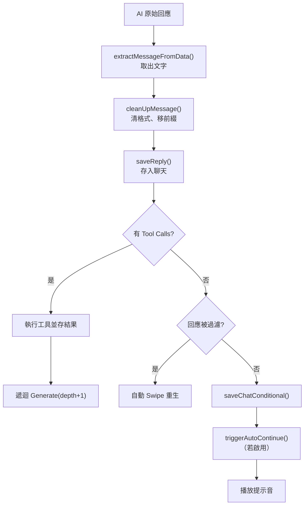

## 🎯 什麼情境該想到我
當你「要設計聊天產品裡『送出、重生、換一個版本、繼續寫、代打、背景呼叫』這些按鈕背後，各自該怎麼改動聊天歷史與 prompt」的時候。

## ⚙️ 怎麼用

### 核心觀念：同一條管線，六種進入方式
SillyTavern 所有生成都走同一個 `Generate(type)`，差別只在 `type` 參數。不同類型決定三件事：**組 prompt 前聊天歷史要怎麼變**、**回應放到哪裡**、**有沒有額外指令**。★ 用一個參數切換行為，而不是六條管線，讓 prompt 組裝管線、[[Token預算管理]]、[[正則替換引擎]] 全部共用。

| 類型 | 使用者操作 | 對聊天歷史的影響 | 回應去向 | 特殊行為 |
|------|-----------|-----------------|---------|---------|
| **normal** | 輸入文字 + Send | 使用者訊息加入聊天 | 顯示在聊天中 | 清空輸入框 |
| **regenerate** | 點重新生成 | 刪除最後一則 AI 訊息 | 取代原回應 | 可能產生不同結果 |
| **swipe** | 左右滑動回應 | 暫時移除最後一則 | 存為**替代版本** | 不刪 DOM，可來回切換 |
| **continue** | 點繼續 | 保留最後 AI 訊息作前綴 | 接在原回應後面 | 累計生成時間 |
| **impersonate** | 點模仿 | 不影響聊天 | **填入輸入框** | 以使用者視角生成 |
| **quiet** | 系統內部呼叫 | 不影響聊天 | **不顯示在 UI** | 用於摘要、SD 提示等 |

### 各類型的關鍵差異

**normal**：清空輸入框 → `sendMessageAsUser()` 把使用者文字寫入聊天 → 組 prompt（已含這句）→ 送 API → 顯示回應。

**regenerate**：先刪除最後一則 AI 訊息，再用「刪除後的歷史」重新組 prompt。因為輸入相同、取樣隨機，所以結果「可能」不同——不是保證不同。

**swipe**：和 regenerate 很像，但舊回應不丟，而是與新回應並存成替代版本，使用者可左右切換。★ 這是「重抽但保留歷史候選」的 UX；regenerate 則是直接覆蓋。

**continue**：保留最後一則 AI 訊息當作前綴放進 prompt，請模型從那裡接下去，最後把新片段與原文**合併**：
```
原訊息：   Alice: 你好！我叫 Alice，
模型續寫：是這家酒館的服務員～
合併結果： 你好！我叫 Alice，是這家酒館的服務員～
```
內建的 Continue Nudge 是 `[Continue your last message without repeating its original content.]`——明確要求不要重複原文，因為模型續寫時很容易把前綴再講一遍。串流時也會把 `continueMessage + text` 一起丟給後處理，讓正則在完整上下文中匹配。

**impersonate**：改用 impersonation prompt（要求從 `{{user}}` 視角、模仿使用者文風寫、不要寫成 `{{char}}` 或 system），回應**不進聊天**，而是填入輸入框讓使用者編輯後再送出。串流時也是填 textarea，正則改用 USER_INPUT placement。

**quiet**：給系統自己用，例如產生摘要（見 [[長期記憶三層架構]]）或圖像生成提示詞。不動聊天、不上畫面。

### 串流處理（StreamingProcessor）
```mermaid
flowchart TD
    I[建立訊息氣泡] --> S[計算停止字串並快取]
    S --> L["for await 讀 generator"]
    L --> T[FPS 節流]
    T --> B["補齊未閉合格式 * \" ``` ~~~"]
    B --> R[渲染到 DOM<br/>impersonate 則填 textarea]
    R --> L
    L -->|串流結束| F[完成處理]
```

- **為什麼要 FPS 節流**：token 逐個到達，若每個都更新 DOM 會頻繁 reflow/repaint、介面卡頓。以 `streaming_fps`（預設 30）限制每秒最多更新 30 次。
- **為什麼要補齊格式**：串流到 `*Alice leans on the counter` 時只有開頭的 `*`，直接渲染會讓後面全部變斜體；系統暫時補上 `*`，串流結束後再拿掉暫時補全。
- **停止字串快取**：含宏時計算昂貴，開始時算一次就好。

逐幀正則的細節（累積文字 vs. delta、兩層正則、執行次數估算）見 [[正則替換引擎]]。

### 後處理流程


兩個值得借鏡的設計：
- **Auto-Swipe**：回應命中過濾黑名單時，自動以 swipe 方式重生一個版本，而不是把壞回應丟給使用者。串流模式下這項檢查只在**串流完成後**做，不會中途觸發。
- **Auto-Continue**：若啟用，存檔後會呼叫 `triggerAutoContinue()` 自動接續生成。

### Tool Calling：用遞迴接回對話
1. `Generate()` 送出 prompt，API 回應帶 `tool_calls`
2. `hasToolCalls()` 為真 → `ToolManager.invokeFunctionTools()` 執行每個工具
3. `saveFunctionToolInvocations()` 把工具結果存進聊天
4. 以 `Generate('normal', { depth: depth + 1 })` **遞迴**再生成一次，這次 prompt 已含工具結果
5. 模型產出最終回應；若又要求工具就再遞迴

★ 把工具結果當成聊天歷史的一部分再走一次完整管線，不需要另外一套 agent loop。**最大遞迴深度 5**，防止模型無限呼叫工具。

### 產品設計時的對照
| 想做的功能 | 對應類型 | 要點 |
|-----------|---------|------|
| 「換一個回答」但可反悔 | swipe | 保留候選陣列 |
| 回覆被截斷 | continue | 前綴 + 不重複指令 + 合併 |
| 「幫我回」建議台詞 | impersonate | 結果進輸入框，不直接送出 |
| 背景摘要、打標籤 | quiet | 不寫聊天、不渲染 |
| 模型要查資料 | tool calling | 遞迴 + 深度上限 |

## ⚠️ 注意 / 什麼時候不適用
- **regenerate 會破壞性刪除**：若產品需要可回溯，優先用 swipe 的「候選版本」模型。
- **continue 仰賴模型遵守不重複指令**：沒有 nudge 時模型常把前綴重講一遍，合併後就重複。
- **quiet 生成仍消耗 token 與延遲**：它共用同一條管線與預算，背景任務太多會跟使用者請求搶資源。
- **工具遞迴要有上限**：SillyTavern 設 5 層；自建時也要設，並考慮每層都會重新組一次完整 prompt 的成本。
- 串流中的暫時補全不是最終內容，任何「看到畫面就存檔」的邏輯要以最終幀為準。

## 🧪 我實際套用的紀錄
- （尚無）

## 🔗 相關
- [[正則替換引擎]]——串流逐幀正則與 impersonate 的 placement 切換
- [[提示覆蓋與系統提示預設]]——Impersonate、Continue Nudge 等內建指令
- [[Token預算管理]]——regenerate / continue 重組 prompt 時的截斷
- [[長期記憶三層架構]]——quiet 生成用於產生摘要
