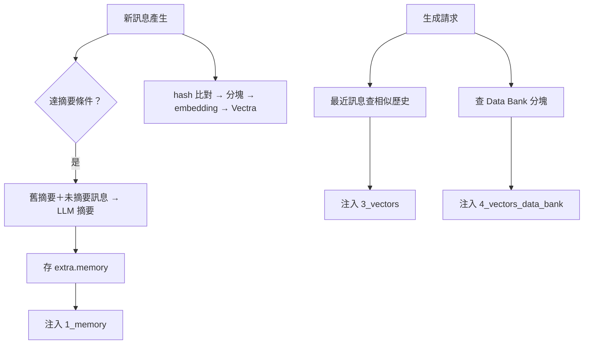

## 🎯 什麼情境該想到我
當你「做的 AI 角色聊天越聊越久，模型開始忘記前情、漏掉使用者早就講過的細節，或需要參考一大份外部設定」的時候。

## ⚙️ 怎麼用

### 問題本質：上下文窗口是硬上限

模型只能看到固定長度的 context（8K～128K tokens）。對話一超過，最舊的訊息就被截斷——模型不是「記性不好」，而是**那段文字根本沒送進去**。所以「長期記憶」在工程上的真正意思是：**用什麼策略，把已經放不下的過去，以更便宜的形式重新塞回這一次的 prompt**。

SillyTavern 用三層各自解決一種遺忘情境，最後都以「extension prompt」的形式注入 prompt：

| 層級 | 機制 | 觸發 | 解決的遺忘 | 注入 key |
|---|---|---|---|---|
| 1. 摘要 Summarize | 用 LLM 把舊對話壓成摘要，滾動更新 | 每 N 條訊息 | 整體脈絡丟失 | `1_memory` |
| 2. 向量 Vectors | 聊天訊息 embedding，生成前以語義找回 | 每次生成前 | 特定細節丟失 | `3_vectors` |
| 3. Data Bank | 外部檔案分塊向量化 | 上傳時索引、生成前查詢 | 角色缺背景知識 | `4_vectors_data_bank` |

★ 三層是**互補**不是替代：摘要保「大綱」、向量保「原文細節」、Data Bank 保「對話以外的知識」。

### 第一層：滾動摘要（像寫會議紀要）

流程：
1. 新訊息產生時檢查條件：距上次摘要已滿 `promptInterval`（預設 10）條，或未摘要字數超過 `promptForceWords`（預設 0＝關閉）。
2. 收集**尚未摘要的訊息**，並把**上一次的摘要**一起放進摘要 prompt。
3. 呼叫 LLM 生成摘要，目標長度 `promptWords`（預設 200 字）。
4. 存在**倒數第二條**訊息的 `extra.memory` 欄位，隨 `.jsonl` 聊天檔持久化。
5. `setExtensionPrompt('1_memory', '[Summary: …]')` 注入 prompt。

**為什麼要帶上一次摘要？** 否則模型只看得到最近 10 條，新摘要會「忘掉」更早的事。帶上舊摘要後，摘要 A（1–10 條）→ 摘要 B（A＋11–20 條）→ 摘要 C（B＋21–30 條），整段歷史被**累積地**壓縮進一段固定長度的文字。

**為什麼存在倒數第二條？** 最後一條可能被 regenerate（重新生成／swipe），存在那裡會跟著被覆蓋掉。

其他設計點：
- 注入位置可選 `IN_PROMPT`（系統提示內）、`IN_CHAT`（聊天歷史指定深度，預設 depth 2）、`BEFORE_PROMPT`。
- 摘要來源三選一：**Main API**（品質最好，但吃主配額）、**Extras API**（專用端點，要另外部署）、**WebLLM**（瀏覽器本地，免費但品質受限）。
- `memoryFrozen` 可凍結摘要（例如使用者手動改好一份滿意的摘要時）；`scan` 決定 World Info 是否也掃描摘要內容來觸發條目。

### 第二層：向量語義召回（找回被截掉的原文）

摘要是**有損壓縮**：「Bob 說他生日是 3 月 15 日」這種細節很可能不會進摘要。向量層做的是**精確召回原始訊息**。

**寫入（新訊息時）**
1. 計算每條訊息的 hash，與已存 hash 比對，找出新增／刪除的訊息（變更偵測，不必全量重算）。
2. 長訊息切成約 `message_chunk_size`＝400 字元的片段。
3. 呼叫 embedding API 轉成向量，寫入本地 **Vectra** 索引。

**查詢（生成前，由 `generate_interceptor` 攔截）**
1. 取最近 `query`＝2 條訊息當查詢文字。
2. 做相似度搜尋，丟掉分數低於 `score_threshold`＝0.25 的結果。
3. 最多取 `insert`＝3 條，套模板 `Past events:\n{{text}}` 注入。
4. 最近 `protect`＝5 條訊息**永遠保留原位**，不被召回結果取代，保持對話連續。

範例：第 50 條「Bob：我的生日是 3 月 15 日」；200 條後 Alice 說「我想為你準備一個驚喜」。「準備驚喜」的向量與那條訊息語義相近（文件舉例相似度 0.78），於是那條原文被撈回 prompt。

★ 跟 World Info 的分工：World Info 是**關鍵字比對**（要真的出現那個詞），向量是**語義比對**（意思相近就會命中）。

embedding 提供者有 17 種以上：雲端（OpenAI、Cohere、Mistral、NomicAI、Google）、本地（Transformers 為預設、Ollama、llama.cpp、vLLM、KoboldCpp）、瀏覽器（WebLLM）、路由（OpenRouter 等）。索引路徑依 `vectors/{source}/{collection}/{model}/` 分開存放，**換 embedding 模型就是另一套索引**（不同模型的向量不能混比）。

### 第三層：Data Bank（給角色一本百科全書）

使用者上傳 PDF、DOCX／XLSX／PPTX、ODT 等、HTML／Markdown、EPUB、純文字：
1. 抽出文字 → 以 `chunk_size_db`＝2500 字元分塊（`overlap_percent_db` 預設 0）。
2. 每塊向量化，存到 collection `file_{hash(url)}`。
3. 生成時用當前對話查詢，取 top `chunk_count_db`＝5 塊，套 `Related information:\n{{text}}` 注入。

三個作用域：

| 作用域 | 儲存位置 | 跨聊天 | 跨角色 | 典型用途 |
|---|---|---|---|---|
| GLOBAL | `extension_settings.attachments` | ✓ | ✓ | 通用世界觀 |
| CHARACTER | `extension_settings.character_attachments[avatar]` | ✓ | ✗ | 角色背景故事 |
| CHAT | `chat_metadata.attachments` | ✗ | ✗ | 本段劇情的參考資料 |

文件標示優先級 CHAT 最高、GLOBAL 最低。這本質上就是一個以角色為中心的 RAG。

### 附加：World Info 的語義觸發

World Info 條目若標 `vectorized=true`，內容也會被向量化；生成時語義命中就以 `WORLDINFO_FORCE_ACTIVATE` 強制激活。解決「對話沒講到精確關鍵字、但明明在談這件事」的漏觸發。

### 三層一起看

| 面向 | 摘要 | 向量 | Data Bank |
|---|---|---|---|
| 資訊粒度 | 粗（概要） | 細（原始訊息） | 中（文件片段） |
| 來源 | 對話歷史 | 對話歷史 | 外部檔案 |
| token 成本 | 低 | 中 | 可能很高 |
| 保真度 | 低（LLM 有損） | 高（原文） | 高（原文） |

一個填滿的 prompt 大致長這樣：

```
[Main Prompt]
[Summary: Alice 和 Bob 結伴冒險，經歷哥布林伏擊後到達地下城入口…]
Past events:
Bob: 我的生日是3月15日
Related information:
地下城指南第3章：封印之門需要三把鑰匙才能開啟…
[角色描述]
[最近的聊天歷史]
```

整體觸發時序（誰在「寫入」、誰在「讀出」）：



★ 寫入與讀出是**分開的兩個時機**：摘要與向量同步掛在「新訊息」事件上，召回掛在「生成請求」上。這讓生成路徑只做查詢（便宜），昂貴的摘要與 embedding 在訊息進來時就先處理掉。

### 資料放哪裡

| 資料 | 位置 | 格式 |
|---|---|---|
| 摘要文字 | `chat[i].extra.memory`（在 .jsonl 內） | 純文字 |
| 摘要設定 | `extension_settings.memory` | JSON |
| 向量索引 | `vectors/{source}/{collection}/{model}/` | Vectra |
| 向量設定 | `extension_settings.vectors` | JSON |
| 全域／角色附件 | `extension_settings.attachments` / `character_attachments[avatar]` | JSON 陣列 |
| 聊天附件 | `chat_metadata.attachments` | JSON 陣列 |

向量目錄下又分 `{chatId}`（聊天向量）、`file_{hash}`（檔案向量）、`world_{hash}`（World Info 向量）三種 collection。設計重點：**摘要跟著聊天檔走**（刪聊天就一起消失、匯出聊天就一起帶走），而向量索引是可重建的衍生資料，另存一處。

效能上的小設計：embedding 按批（1–5 條）送出；摘要在同一 session 有 `cachedSummaries` 快取；訊息 hash 快取加速變更偵測；向量同步 1000ms debounce、metadata 儲存 10000ms debounce——避免使用者連續打字／編輯時狂打 API。

## ⚠️ 注意 / 什麼時候不適用

- **摘要會漂移**：每次都是「舊摘要＋新訊息」再壓一次，早期錯誤或遺漏會被一路繼承。重要事實別只靠摘要保存；必要時手動修正後用 `memoryFrozen` 凍結。
- **摘要要花一次額外 LLM 呼叫**：用 Main API 會吃主配額與延遲；產品化時通常要改成非同步、便宜模型處理。
- **向量召回只看語義相近，不看時序與真偽**：可能撈回已被後續劇情推翻的舊訊息（例如「我不喜歡你」後來已和好）。`score_threshold` 太低會塞進雜訊，太高又什麼都撈不到。
- **query 只用最近 2 條**：如果最近兩句很短（「嗯」「然後呢」），查詢語義太弱，召回品質會很差。
- **Data Bank 很吃 token**：5 塊 × 2500 字元，一次就可能上萬字元，必須跟 [[Token預算管理]] 一起規劃。
- 三層預設都**關閉**（`enabled_chats`、`enabled_files` 預設 false），不開就只有截斷。
- 短對話、一次性聊天用不到；context 足夠裝下全部歷史時，加這些只會增加成本與不確定性。

## 🧪 我實際套用的紀錄
- （尚無）

## 🔗 相關
- [[工具-RAG檢索增強生成]] — 向量層與 Data Bank 就是聊天場景的 RAG
- [[Token預算管理]] — 記憶注入要從同一個 token 預算裡分
- [[Authors Note與深度注入]] — 摘要與向量結果都走 extension prompt 的注入機制
- [[World Info世界書]] — 關鍵字觸發 vs 語義觸發的互補
